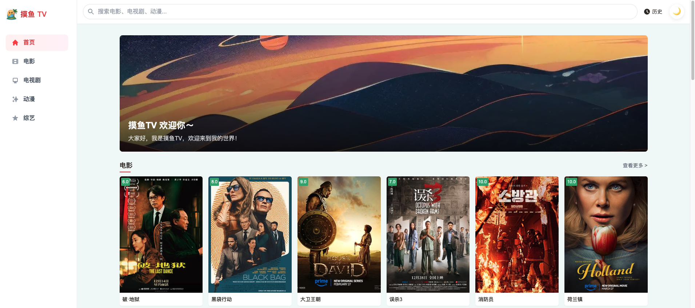
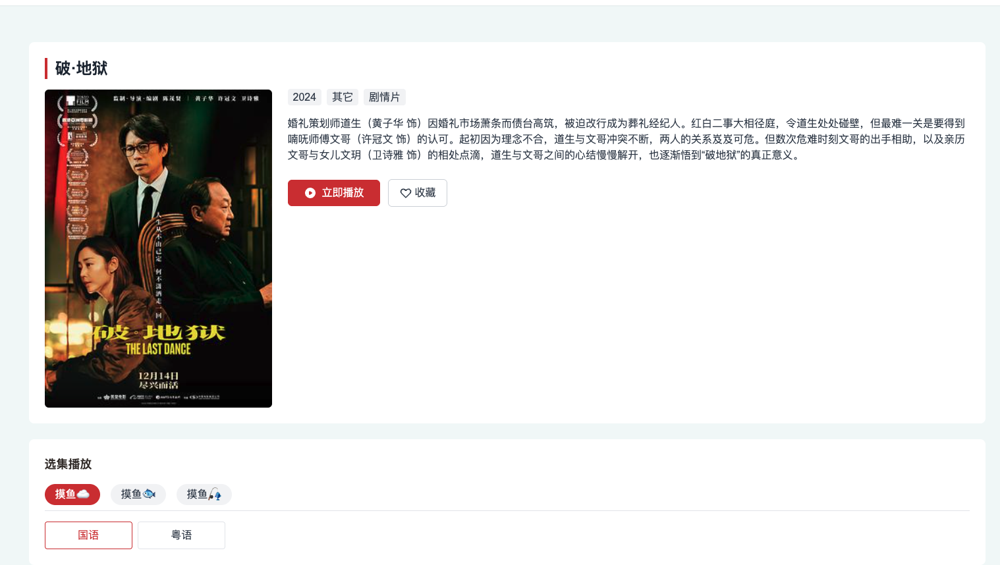
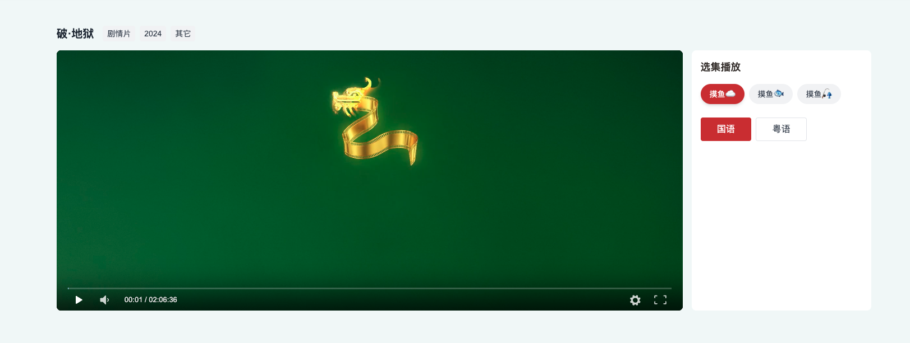
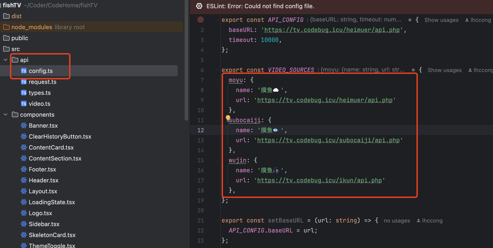
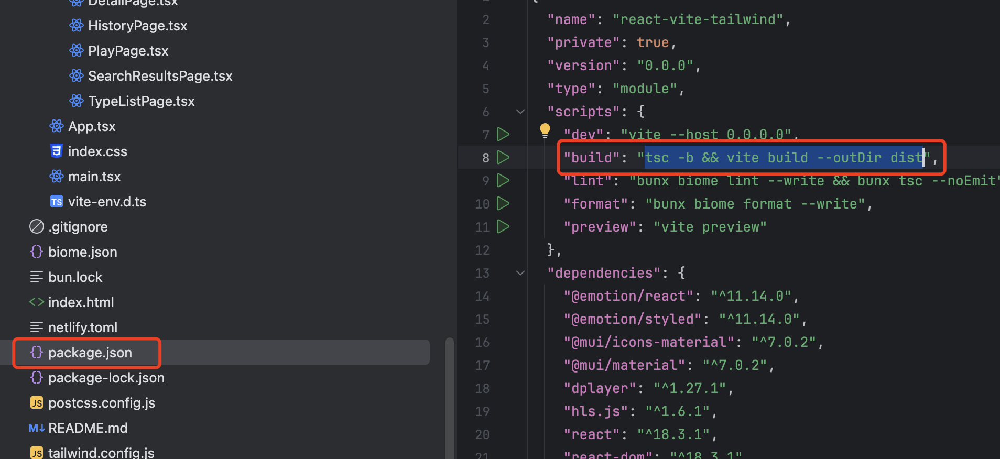
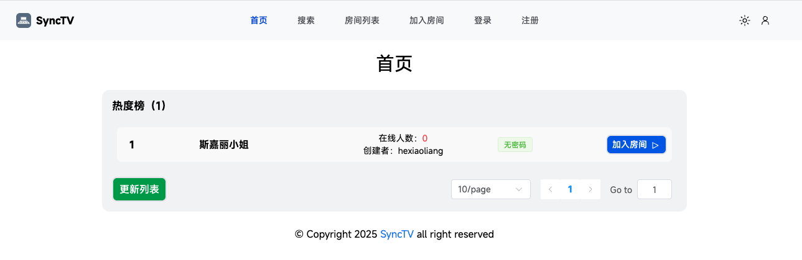

# 🌟摸鱼 TV 搭建属于自己的视频站

## 前言🔉

你是否有时烦恼自己想观看某个电影或者电视找不到资源，或者之前自己看的网站倒闭了，那不妨来自己搭一个视频🚉！让你的兄弟、好姐妹、女朋友对你眼前一亮！这个项目是根据 maccms10 视频资源规则来实现的，项目是纯前端项目❤️‍🔥，后面我也会给出配合后端方向的改进点，欢迎大家扩展。



## 项目介绍🤩

项目在线地址🚀：https://tv.codebug.icu/

项目 Github 地址🔥：https://github.com/lhccong/fishTV

项目是基于 React + Dplayer + Nginx 反代 +  maccms10 视频资源规则实现的，目前项目实现了手机端的适配以及可以查看历史内容、切换暗黑模式等基础功能，已经与日常网站播放十分相似。

### 分类界面


### 详情界面



### 播放界面




## 项目部署操作🍉

### 基于 Nginx 反向代理

由于有不同的数据源需要操作，而往往这些数据源都涉及了跨域，那么为了避免跨域我直接从 Nginx 反向代理解决了跨域问题。

1、拉取源码到本地：https://github.com/lhccong/fishTV   请给主播点个 star 不要白嫖呀。

```shell
git clone  https://github.com/lhccong/fishTV
```

2、修改数据源。

目前我的数据源有三个，都通过了 Nginx 反向代理来处理，你可以使用我的或者直接自己加上自己的反向代理。

文件位置：src/api/config.ts



修改这几个就是基于maccms10 规则的数据源了，后面我会给出一堆的数据源给大家的。

我 nginx 的反代跨域配置文件也给到大家如下⬇️。

```nginx
location ^~ /heimuer {
        proxy_pass https://heimuer.tv/;
        proxy_set_header Host heimuer.tv;
        proxy_set_header X-Real-IP $remote_addr;
        proxy_set_header X-Forwarded-For $proxy_add_x_forwarded_for;
        proxy_ssl_server_name on;

        # 解决 CORS 问题
        add_header Access-Control-Allow-Origin *;
        add_header Access-Control-Allow-Methods "GET, POST, OPTIONS";
        add_header Access-Control-Allow-Headers "DNT,User-Agent,X-Requested-With,If-Modified-Since,Cache-Control,Content-Type,Range";
        add_header Access-Control-Expose-Headers "Content-Length,Content-Range";

        # 处理 OPTIONS 预检请求
        if ($request_method = OPTIONS) {
            return 204;
        }
}
location ^~ /ikun {
    proxy_pass https://api.ffzyapi.com/; 
    proxy_set_header Host api.ffzyapi.com; 
    proxy_set_header X-Real-IP $remote_addr; 
    proxy_set_header X-Forwarded-For $proxy_add_x_forwarded_for; 
    proxy_ssl_server_name on; 
    # 解决 CORS 问题
    add_header Access-Control-Allow-Origin *; 
    add_header Access-Control-Allow-Methods "GET, POST, OPTIONS"; 
    add_header Access-Control-Allow-Headers "DNT,User-Agent,X-Requested-With,If-Modified-Since,Cache-Control,Content-Type,Range"; 
    add_header Access-Control-Expose-Headers "Content-Length,Content-Range"; 
    # 处理 OPTIONS 预检请求
    if ($request_method = OPTIONS) {
        return 204; 
    }
    add_header Cache-Control no-cache; 
}
location ^~ /subocaiji {
    proxy_pass http://subocaiji.com/; 
    proxy_set_header Host subocaiji.com; 
    proxy_set_header X-Real-IP $remote_addr; 
    proxy_set_header X-Forwarded-For $proxy_add_x_forwarded_for; 
    proxy_ssl_server_name on; 
    # 解决 CORS 问题
    add_header Access-Control-Allow-Origin *; 
    add_header Access-Control-Allow-Methods "GET, POST, OPTIONS"; 
    add_header Access-Control-Allow-Headers "DNT,User-Agent,X-Requested-With,If-Modified-Since,Cache-Control,Content-Type,Range"; 
    add_header Access-Control-Expose-Headers "Content-Length,Content-Range"; 
    # 处理 OPTIONS 预检请求
    if ($request_method = OPTIONS) {
        return 204; 
    }
    add_header Cache-Control no-cache; 
}
```


3、打包项目

```shell
tsc -b && vite build --outDir dist
```



生成 dist 就可以丢到服务器访问了

### 基于 Express 作为反向代理

这个我之前简单实现了下，但是由于我还是比较喜欢静态前端，就没有使用express 作为反向代理的后端，想研究的前端朋友可以自己实现一下，很简单的作为处理，可以直接喊 AI 帮你改都行，不过改完之后要使用 node.js 部署了，不能直接作为静态前端界面运行。


## 项目实现原理🚀

项目实现很简单就是基于 maccms10 api 来直接读取别人资源站的 json ，但是目前很多地方都没有怎么清晰讲解如何使用，我也是把我了解到的这个 api 的 参数给到大家。具体的官方文档可以直接查看

https://github.com/magicblack/maccms10/blob/master/%E8%AF%B4%E6%98%8E%E6%96%87%E6%A1%A3/API%E6%8E%A5%E5%8F%A3%E8%AF%B4%E6%98%8E.txt

```json
api接口仅供提供数据

视频接口同时支持老板xml格式的数据，增加参数 &at=xml即可。

1,视频部分
列表http://域名/api.php/provide/vod/?ac=list
详情http://域名/api.php/provide/vod/?ac=detail
同样支持老板xml格式的数据
列表api.php/provide/vod/at/xml/?ac=list
详情api.php/provide/vod/at/xml/?ac=detail

2,文章部分
列表http://域名/api.php/provide/art/?ac=list
详情http://域名/api.php/provide/art/?ac=detail

3,演员部分
列表http://域名/api.php/provide/actor/?ac=list
详情http://域名/api.php/provide/actor/?ac=detail

4,角色部分
列表http://域名/api.php/provide/role/?ac=list
详情http://域名/api.php/provide/role/?ac=detail

5,网址部分
列表http://域名/api.php/provide/website/?ac=list
详情http://域名/api.php/provide/website/?ac=detail

列表数据格式：

{"code":1,"msg":"数据列表","page":1,"pagecount":1,"limit":"20","total":15,"list":[{"vod_id":21,"vod_name":"测试1","type_id":6,"type_name":"子类1","vod_en":"qingjian","vod_time":"2018-03-29 20:50:19","vod_remarks":"超清","vod_play_from":"youku"},{"vod_id":20,"vod_name":"测试2","type_id":6,"type_name":"子类1","vod_en":"baolijiequ","vod_time":"2018-03-27 21:17:52","vod_remarks":"超清","vod_play_from":"youku"},{"vod_id":19,"vod_name":"测试3","type_id":6,"type_name":"子类3","vod_en":"chaofanzhizhuxia2","vod_time":"2018-03-27 21:17:51","vod_remarks":"高清","vod_play_from":"youku"},{"vod_id":18,"vod_name":"测试4","type_id":6,"type_name":"子类4","vod_en":"muxingshangxing","vod_time":"2018-03-27 21:17:37","vod_remarks":"高清","vod_play_from":"youku"},{"vod_id":15,"vod_name":"测试5","type_id":6,"type_name":"子类5","vod_en":"yingxiongbense2018","vod_time":"2018-03-22 16:09:17","vod_remarks":"高清","vod_play_from":"qiyi,sinahd"},{"vod_id":13,"vod_name":"测试6","type_id":8,"type_name":"子类6","vod_en":"piaoxiangjianyu","vod_time":"2018-03-21 20:37:52","vod_remarks":"全36集","vod_play_from":"youku,qiyi"},{"vod_id":14,"vod_name":"测试7","type_id":8,"type_name":"子类7","vod_en":"guaitanzhimeiyingjinghun","vod_time":"2018-03-20 21:32:27","vod_remarks":"高清","vod_play_from":"qiyi"}]}


列表接收参数：
ac=list
t=类别ID
pg=页码
wd=搜索关键字
h=几小时内的数据
例如： http://域名/api.php/provide/vod/?ac=list&t=1&pg=5   分类ID为1的列表数据第5页


内容数据格式：
{"code":1,"msg":"数据列表","page":1,"pagecount":1,"limit":"20","total":1,"list":[{"vod_id":21,"vod_name":"测试1","type_id":6,"type_name":"子类1","vod_en":"qingjian","vod_time":"2018-03-29 20:50:19","vod_remarks":"超清","vod_play_from":"youku","vod_pic":"https:\/\/localhost\/view\/photo\/s_ratio_poster\/public\/p2259384068.jpg","vod_area":"大陆","vod_lang":"国语","vod_year":"2018","vod_serial":"0","vod_actor":"主演们","vod_director":"导演","vod_content":"这可是详情介绍啊","vod_play_url":"正片$http:\/\/localhost\/v_show\/id_XMTM0NTczNDExMg==.html"}]}


内容接收参数：
参数 ids=数据ID，多个ID逗号分割。
     t=类型ID
     pg=页码
     h=几小时内的数据

例如:   http://域名/api.php/provide/vod/?ac=detail&ids=123,567     获取ID为123和567的数据信息
        http://域名/api.php/provide/vod/?ac=detail&h=24     获取24小时内更新数据信息


另附上xml返回格式：
列表数据格式：
<?xml version="1.0" encoding="utf-8"?><rss version="5.0"><list page="1" pagecount="23" pagesize="20" recordcount="449"><video><last>2012-05-06 13:32:28</last><id>493</id><tid>9</tid><name><![CDATA[测试]]></name><type>子类1</type><dt>dplayer</dt><note><![CDATA[]]></note><vlink><![CDATA[http://localhost/vod/?493.html]]></vlink><plink><![CDATA[http://localhost/vodplay/?493-1-1.html]]></plink></video></list><class><ty id="1">分类1</ty><ty id="2">分类2</ty><ty id="3">分类3</ty><ty id="4">分类4</ty><ty id="5">子类1</ty><ty id="6">子类2</ty><ty id="7">子类3</ty><ty id="8">子类4</ty><ty id="9">子类5</ty><ty id="10">子类6</ty><ty id="11">子类7</ty><ty id="12">子类8</ty><ty id="13">子类9</ty><ty id="14">子类10</ty><ty id="15">子类11</ty></class></rss>

内容数据格式：
<?xml version="1.0" encoding="utf-8"?><rss version="5.0"><list page="1" pagecount="1" pagesize="20" recordcount="1"><video><last>2012-05-06 13:32:28</last><id>493</id><tid>9</tid><name><![CDATA[测试1]]></name><type>恐怖片</type><pic>http://localhost/uploads/20091130205750222.JPG</pic><lang>英语</lang><area>欧美</area><year>2012</year><state>0</state><note><![CDATA[]]></note><type>_9</type><actor><![CDATA[]]></actor><director><![CDATA[Ryan Schifrin]]></director><dl><dd from="qvod"><![CDATA[第1集$http://localhost/1.mp4|]]></dd></dl><des><![CDATA[<p>简单介绍。 <br /></p>]]></des><vlink><![CDATA[http://localhost/vod/?493.html]]></vlink><plink><![CDATA[http://localhost/vodplay/?493-1-1.html]]></plink></video></list></rss>
```


### 所用到的 API

获取页面数据列表：https://heimuer.tv/api.php/provide/vod/?ac=videolist&pg=0&pagesize=10&t=1

获取分类列表数据：https://heimuer.tv/api.php/provide/vod/?ac=list&pagesize=1

获取分集列表数据：详情页中获取，[https://heimuer.tv/api.php/provide/vod/?ac=detail&ids=%2046579](https://heimuer.tv/api.php/provide/vod/?ac=detail&ids= 46579)

所有基于maccms10 的资源站 API 都是一样的，只有前缀不同：前缀/api.php/provide/vod/?ac=videolist&pg=0&pagesize=10&t=1


## 资源站接入大全 📚

- 暴风采集站：https://publish.bfzy.tv/
- 非凡采集站：http://ffzy5.tv/ ✅
- 快看采集站：https://kuaikanzy.net/
- 乐视采集站：https://www.leshizy1.com/
- 量子采集站：[http://lzizy.net](http://lzizy.net/)
- 索尼采集站：https://suonizy.net/
- 红牛：https://hongniuziyuan.net/
- 优质资源库：[https://1080zyk6.com](https://1080zyk6.com/)
- 鸭鸭资源库：[https://yayazy.com](https://yayazy.com/)
- 牛牛资源：[https://niuniuzy.cc](https://niuniuzy.cc/)
- OK资源网：[https://okzyw.vip](https://okzyw.vip/)
- 49资源网：[https://49zyw.com](https://49zyw.com/)
- 360资源站：[https://360zy5.com](https://360zy5.com/)
- 奇虎资源站：[https://qihuzy4.com](https://qihuzy4.com/)
- 黑木耳:https://www.heimuer.tv/ ✅
- 华为：https://cjhwba.com/
- 九月：https://jiuyuezy.com/
- 卧龙：https://wolongzyw.com/
- 虎牙：https://huyazy.com/
- 淘片：https://www.taopianzy.com/index.html
- ikun：https://ikunzy.net/
- 麒麟：https://www.qilinzyz.com/
- 急速：https://www.jisuzy.com/
- 豪华：https://haohuazy.com/
- 快车：https://kuaichezy.com/
- 速播：https://www.suboziyuan.net/ ✅
- 新浪：https://www.xinlangzy.net/
- 光速：https://guangsuzy.com/
- 无尽：https://www.wujinzy.net/
- 金鹰：https://jinyingzy.com/
- 魔都：https://moduzy.com/

目前打 ✅ 的是我用到的资源站，其它的资源站感兴趣的朋友可以自己接入一下。


## 扩展点🌟

1. 实现用户登录，保存用户的收藏影片以及浏览历史记录。

2. 自己实现数据库，爬取资源站的内容来实现按年份、地区等视频的分类。

3. 实现在线一起观看功能，可以创建房间以及聊天，简单思路：通过 ws 同步播放、暂停等操作以及监听房间每个人的视频进度，若与房主有差别，轻微动态聊整播放速度追赶。

   参考：https://github.com/synctv-org/synctv  在线体验地址：https://synctv.006.cloudns.org/web/

   

## 最后 ✨

感谢大家看到最后，我是聪 希望可以跟大家一起学习，如果文章对大家有帮助的话不妨给我的新项目[ 摸鱼岛🐟](https://github.com/lhccong/fish-island-backend) 点个免费的 star 🌟，我的 Github：[github.com/lhccong](https://link.juejin.cn/?target=https%3A%2F%2Fgithub.com%2Flhccong) 如果里面有你感兴趣的项目也可以点个星星⭐和关注🔥，未来我还会持续写新的好玩的小项目。